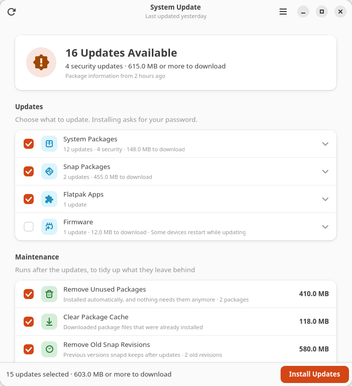
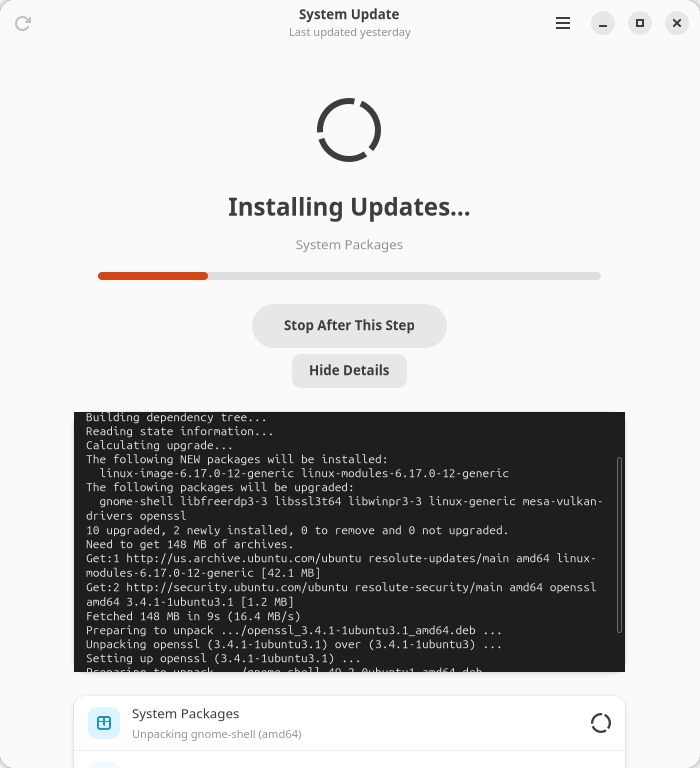
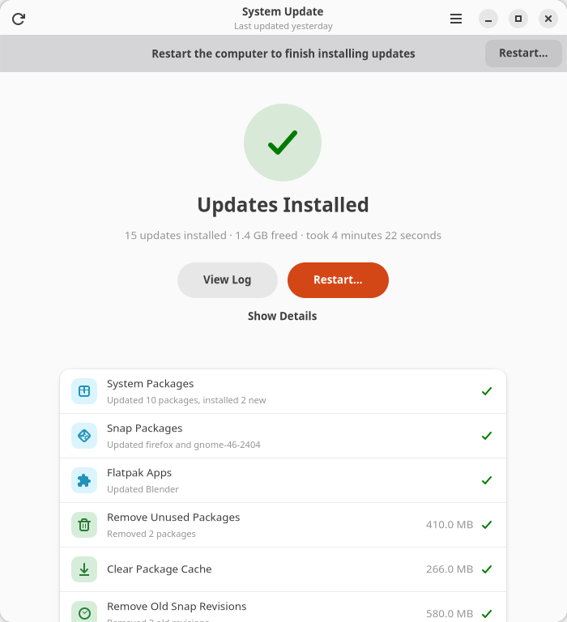
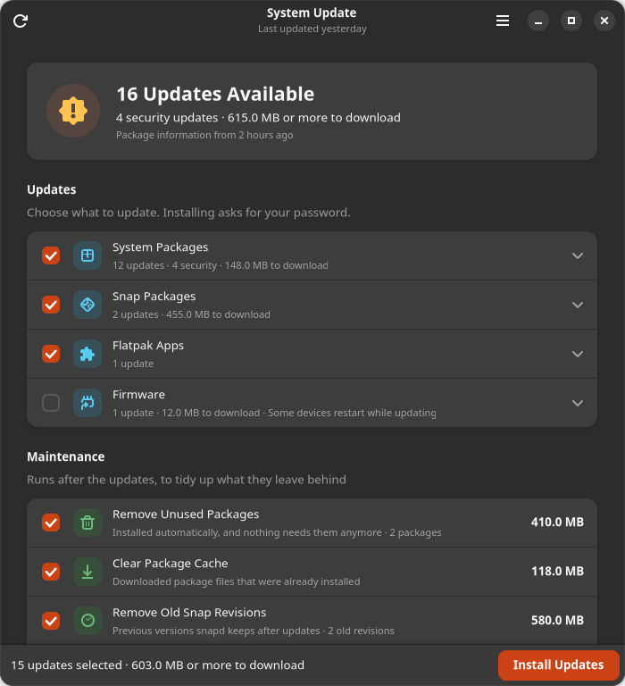

# System Update

[](https://github.com/wakedog/system-update/actions/workflows/ci.yml)
[](LICENSE)

Keep Ubuntu and everything installed on it up to date, in one place.

System Update installs updates for system packages (APT), snaps, Flatpak apps
and device firmware (fwupd), then tidies up what the updates leave behind:
unused packages, the package cache, old snap revisions, unused Flatpak
runtimes and old journal entries. You see everything that is available before
anything changes. It is a GNOME desktop app with a matching command-line
interface, rebuilt from the `system-update.sh` script, and it still accepts
that script's options.



## Install

Download the `.deb` from the
[latest release](https://github.com/wakedog/system-update/releases/latest) and
install it with `sudo apt install ./system-update_*_all.deb`, or build it from
source:

```bash
sudo apt install git make
git clone https://github.com/wakedog/system-update.git
cd system-update
make deb
sudo apt install ./dist/system-update_1.0.0_all.deb
```

Then open **System Update** from the app grid, or run `system-update`.
Remove it again with `sudo apt remove system-update`.

It needs Ubuntu 24.04 or newer (GTK 4 and libadwaita 1.5+), and is developed
on Ubuntu 26.04. Everything it depends on ships with a standard Ubuntu
desktop. Snap, Flatpak and fwupd are used when they are installed.

## Using the app

The app checks for updates as soon as it opens. When the package information
is more than an hour old it refreshes it first, which needs no password.

- Every source is listed with what it would update. Expand a row to see each
  package, with its old and new version and whether it is a security update.
- Untick what you want to leave out. Firmware updates are off until you tick
  them, and ask for confirmation, because some devices restart while they
  update. Your choices are remembered.
- **Install Updates** asks for your password once, then shows each step as it
  runs. **Show Details** opens the full output of every command.
- **Stop After This Step** finishes the current step and skips the rest.
  Installing packages is never interrupted.
- When a restart is needed, a banner says so, with a **Restart…** button.
- **Update History** in the main menu lists every run, including the ones a
  timer started, and opens each run's log.
- **Preferences** set whether to check when the app opens, how much of the
  system journal to keep, and whether outdated services are restarted
  automatically (when needrestart is installed).

| Installing | Finished |
| --- | --- |
|  |  |

It follows the system's light or dark style:



## Command line

```bash
system-update check                  # what can be updated; changes nothing
system-update check --json | jq .security   # security updates waiting, for monitoring
system-update upgrade                # install everything and clean up
system-update upgrade --dry-run      # show what would be done
system-update upgrade --no-snap --no-cleanup
system-update history                # past runs, including timer runs
```

`check` exits with 100 when updates are available and 0 when everything is
up to date. `upgrade` exits with 0 on success, 1 when some step failed, and 3
when it could not start (another update running, no network, or
authentication failed). See `man system-update` for every option.

### Replacing system-update.sh

The script's options still work, and `system-update` without arguments, run
as root, updates the system just like the script did:

```bash
sudo system-update --yes            # same as: system-update upgrade --yes
sudo system-update --dry-run --no-firmware
```

`--yes` still means fully unattended: firmware updates are installed and
needrestart restarts outdated services. Without it, firmware updates are only
listed. So a timer or cron job that runs `system-update.sh --yes` can run
`/usr/bin/system-update --yes` instead. Both use the same lock file, so they
never run at the same time, and logs go to the same folder,
`/var/log/system-update/`, in the same format.

## What it does

| Step | id | How | In the app |
| --- | --- | --- | --- |
| System packages | `apt` | waits for other package managers, then `apt-get update`, `dpkg --configure -a`, `apt-get -f install` and `apt-get full-upgrade`, keeping existing configuration files | on |
| Snap packages | `snap` | refreshes every snap through snapd, with progress | on |
| Flatpak apps | `flatpak` | `flatpak update` for the system installation and for yours | on |
| Firmware | `firmware` | `fwupdmgr refresh` and `fwupdmgr update` | off |
| Remove unused packages | `autoremove` | `apt-get autoremove --purge` | on |
| Clear package cache | `apt_cache` | `apt-get clean` | on |
| Remove old snap revisions | `snap_revisions` | removes the disabled revisions snapd keeps | on |
| Remove unused runtimes | `flatpak_unused` | `flatpak uninstall --unused` | on |
| Trim system journal | `journal` | `journalctl --rotate --vacuum-time --vacuum-size` (7 days, 200 MB) | on |

Steps that don't apply (no snapd, no Flatpak, no fwupd) are hidden.

## Safety

- **Nothing ever stops to ask a question.** Every tool runs
  non-interactively, so a run nobody is watching can't hang on a prompt.
- **apt and dpkg are never interrupted.** Only snap, Flatpak and fwupd, whose
  work is done by a service, have time limits. Stop and Ctrl+C finish the
  current step first.
- **One update at a time.** It takes the same lock as `system-update.sh`,
  and waits up to 5 minutes for other package managers, such as
  unattended-upgrades, telling you which program it is waiting for.
- **Root access is narrow.** Updates are installed by a separate helper,
  `/usr/libexec/system-update/system-update-helper`, started through `pkexec`
  and authorized by a polkit policy. It accepts only fixed step names and
  range-checked numbers, never commands, paths or package names. Refreshing
  package information needs no password; installing does, once per run.
- **Everything is recorded.** Each run writes a log to
  `/var/log/system-update/`, readable by administrators (the `adm` group), and
  a line to the history in `/var/lib/system-update/history.jsonl`.

## Changes from `system-update.sh`

- A desktop app with live progress, the full output one click away, and a
  history of every run. The script had only its log file.
- Snaps are refreshed through snapd's API, so their progress is shown, and
  snaps that could not update yet, usually because they are running, are
  named instead of being reported as done.
- Flatpak apps installed only for you are updated too. The script ran as root
  and only saw the system installation.
- The network check tries your own package mirrors first and trusts a
  configured apt proxy. The script gave up when it could not reach
  archive.ubuntu.com directly, even where a proxy or local mirror would have
  worked.
- Waiting for other package managers no longer needs `fuser` or `lsof`, and
  names the program that holds the lock.
- It also warns when `/boot` is nearly full, a common reason kernel updates
  fail.
- Logs can be read by administrators without `sudo`, and each step can be
  left out (`--no-snap`, `--no-flatpak`, `--no-cleanup`).
- Exit status: `upgrade` returns 0, 1 or 3 (see above) instead of the number
  of failed steps.

## Development

See **[docs/DEVELOPMENT.md](docs/DEVELOPMENT.md)** for setting up a
development machine, how the code fits together, adding an update source or
maintenance step, and releasing a new version, and
[CONTRIBUTING.md](CONTRIBUTING.md) for the ground rules. The short version:

```bash
make run                  # run the app from this folder
make test                 # unit tests
make check                # tests plus desktop, AppStream and polkit validation
make deb                  # build dist/system-update_<version>_all.deb
tools/screenshots.py      # render every screen to build/screenshots on a hidden display
```

Running from the source tree works without installing. Polkit then shows its
generic "run a program as administrator" prompt, even for checking, because
the policy only applies to the installed helper. The app therefore doesn't
refresh package information by itself when run from source; use **Check for
Updates** (Ctrl+R) to do it.

```text
system_update/
  helper.py       privileged helper (standard library only, runs as root) and the queries it shares
  updates.py      the update sources and maintenance steps, and the password-free check
  engine.py       runs the helper through pkexec, turns its output into events
  cli.py          command-line interface
  history.py      reads the run history
  gui/            GTK 4 / libadwaita app
data/             icons, .desktop file, AppStream metadata, polkit policy, man page
packaging/        .deb build script
tests/            unit tests
tools/            screenshot renderer
docs/             developer guide
.github/          CI and release workflows
```

## License

MIT. See [LICENSE](LICENSE).
